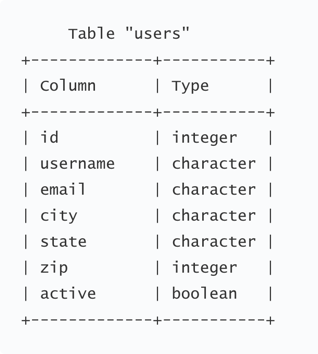
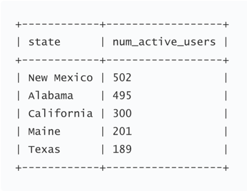

** 1. Describe a data project you worked on recently.**

I recently worked on OpenStreetMap (OSM) data project. I wanted to parse the raw OSM data of Austin, TX in XML format to the tabular format for entry into SQLite database. I was particularly interested in node and way tags. Nodes are point features defined by its latitude, longitude and node id. Ways are paths through a city of one kind or another like Street, Avenue, Drive, Boulevard etc.
<br>
While auditing the osm file for validity, accuracy, completeness, consistency, and uniformity I found that there were several problems with the map. There were Overabbreviated Street Names, Inconsistent and Incorrect postal codes, Inconsistent state name, Inconsistent phone number format, Username error etc. I wrote scripts to fix problems with the data, parsed the data into a tabular format and imported it into the SQLite database following a schema. 
<br>
It was quite a work, the dataset was large - 17 million lines of raw XML, so I had to first create a random subset of the data, and later apply the scripts I wrote to full dataset but I learned a lot.

**2. You are given a ten piece box of chocolate truffles. You know based on the label that six of the pieces have an orange cream filling and four of the pieces have a coconut filling. If you were to eat four pieces in a row, what is the probability that the first two pieces you eat have an orange cream filling and the last two have a coconut filling?**

Probability of first orange cream filling is 6/10.
Probability of second orange cream filling is 5/9.
Probability of third coconut filling is 4/8.
Probability of the last coconut filling is 3/7.
Probability that the first two pieces you eat have an orange cream filling and the last two have a coconut filling are
6/10 * 5/9 * 4/8 * 3/7 = 0.0714

**Follow-up question: If you were given an identical box of chocolates and again eat four pieces in a row, what is the probability that exactly two contain coconut filling?**

In this question the order in which chocolates are eaten are irrelevant

Probability that exactly two contain coconut filing = (Number of different ways in which two coconut chocolates can be choosen from four * Number of different ways in which two orange chocolates can be choosen from six)/ Total number of ways four chocolates can be choosen from ten
= (4C2 * 6C2)/10C4 = 0.428

**3. Given the table users:**

**construct a query to find the top 5 states with the highest number of active users. Include the number for each state in the query result. Example result:**


```
SELECT state, SUM(active)
FROM users
GROUP BY state
ORDER BY SUM(active) DESC
LIMIT 5;
```

**4. Define a function first_unique that takes a string as input and returns the first non-repeated (unique) character in the input string. If there are no unique characters return None. Note: Your code should be in Python.**

Step 1: Initialize an array of size 256 for holding the count frequency of characters in the string. 
Step 2: Scan the string from left to right and update the count frequency in the array.
Step 3: Scan the string once again to search for the first character with count frequency of 1 and return it.

Space Complexity: O(1)
Time Complexity: 0(N), where N is the length of string.

```
def count_array(string):
    '''Returns an array of size 256 containing count of the characters in the string.'''
    array = [0] * 256
    for i in string:
        array[ord(i)] += 1
    return array            

def first_unique(string):
    '''Input: String
    Output: The first non-repeated (unique) character in the input string.'''
    count = count_array(string)
    unique_char = None
    for i in string:
        if count[ord(i)] == 1:
            unique_char = i
            break
    return unique_char
```


**5. What are underfitting and overfitting in the context of Machine Learning? How might you balance them?**

Nobel laureate Ronald Coase said, "If you torture the data long enough, it will confess." Overfitting occurs when data mining procedures perform too well on the training dataset, however, fails to generalize on unseen datasets.  As the model becomes more complex it tends to pick up spurious correlations (noise) in the data that are not the characteristics of the population in general. It is quite possible that data mining procedures build the model in these cases purely based on memorization. To limit overfitting we can reduce the complexity of the model by limiting the features used and increasing the amount of regularization. It is also required to keep a subset of data as holdout set for testing the performance of the model on unseen data. We can also use a more sophisticated holdout training and testing procedure called Cross-validation.

Underfitting occurs when the model performs well neither on the training dataset nor generalize well to the unseen datasets. The underfitting model will have poor performance on the training data. It is because the model is too simple and the input features are not expressive enough to describe the target variable very well. To increase the model flexibility we can add new domain specific features, decrease the amount of regularization used, and try alternate machine learning algorithms.


**6. If you were to start your data analyst position today, what would be your goals a year from now?**

What really excites me is to translate my technical and problem-solving skills into products that can have a lasting impact on the business and the people. At first I would make myself comfortable with the Dow Jones database, ongoing business intelligence efforts, and large scale data science projects. I would continue analyzing the company's large treasure of datasets from tens of thousands of news and business sources in almost 200 countries to generate actionable insights that can add value to the business. I will learn about the customer metrics that Dow Jones tracks and work with the team to improve the experience of reading The Wall Street Journal.

I envision myself as a data scientist and an invaluable asset to the team who constantly puts himself out of comfort zone. I understand lifelong learning will be an important part of realizing these goals, hence I will continue learning Machine learning, Deep learning, and Artifical Intelligence on my personal level.
