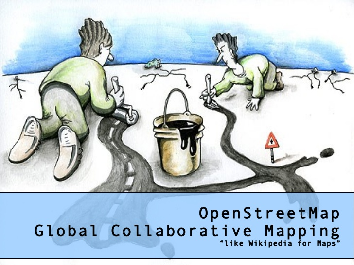

# Project 3: OSM Data Wrangling 
I live in the outskirts of Austin and love the plethora of outdoor activities :rowboat: the city of Austin has to offer. For this project, I wrangled 17 million lines of raw OpenStreetMap data :memo: of Austin (TX), using Python and built a user-friendly SQLite database. I used data munging techniques, such as assessing the quality of the data for validity, accuracy, completeness, consistency, and uniformity, to clean the OpenStreetMap data. In return, I discovered :tada: new things about Austin.

 
[Image courtesy - Mikel Maron](https://www.slideshare.net/mikel_maron/osm-transport)

# Project Details
### 1. A pdf document containing your answers to the rubric questions. This file should document your data wrangling process.

The name of this file is [P3-OSM-Data-Wrangling.pdf](https://github.com/arjan-hada/Udacity-Data-Analyst/blob/master/P3-OSM-data-wrangling/P3-OSM-Data-Wrangling.pdf) and is generated from P3-OSM-Data-Wrangling.ipynb inside the osm folder.

### 2. Your Python code you used in auditing and cleaning your dataset for the final project. You may also include the original Case Study scripts, but make sure it is clear which code was used for the project, and which applies to the lesson quizzes.

Folder osm contains all the python scripts used for this project. 

Python code used for auditing and cleaning data is in osm/data_sql.py. The project was run using Python 2.7.

### 3. A text file containing a link to the map position you wrangled in your project, a short description of the area and a reason for your choice.

For this case study, I have explored the OSM map of Austin, TX. 
https://mapzen.com/data/metro-extracts/metro/austin_texas/

I live in the outskirts of Austin. I love the plethora of outdoor activities the city of Austin has to offer. I took this opportunity to contribute to OpenStreetMap.org by wrangling the data and parsing it for for SQLite database entry. In the process, I discovered new things about Austin.

### 4. An .osm file containing a sample part of the map region you used (around 1 - 10 MB in size). See the notes below.

Sample part of map (sample.osm) is located in osm/data.

### 5. A text file containing a list of Web sites, books, forums, blog posts, github repositories etc that you referred to or used in this submission (Add N/A if you did not use such resources).

Reference section is included in  P3-OSM-Data-Wrangling.pdf towards the end.