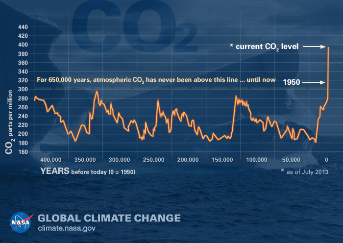

# Explore greenhouse gas emissions 
If you know me I deeply care about the health of our planet. The biggest threat our civilization and the life of planet :earth_americas: right now is global warming. According to Intergovernmental Panel on Climate Change - "Scientific evidence for warming of the climate system is unequivocal". The major cause of global warming is the human expansion of natural greenhouse gases. Continued exploitation of fossil fuels :fuelpump: on business-as-usual rate has increased the concentration of atmospheric carbon dioxide (CO2) forcing the climate to change over the years :cyclone::ocean:.

 
Data: National Oceanic and Atmospheric Administration. Graphic and some description adapted from [NASA](https://climate.nasa.gov/causes/).

In this project, I explore the historic greenhouse gas emissions data for different countries using R and apply exploratory data analysis techniques. In the process, I also build a Shiny app for everyone to explore the 42 years of greenhouse gas emissions by different countries. You can play with my shiny app [here](https://arjan-hada.shinyapps.io/greenhouse-gas/)

## Getting Started
1. Clone the Udacity-Data-Analyst repo to your computer.
2. Get into the folder `Udacity-Data-Analyst/P4-Explore-greenhouse-dataset`.
3. Open up `ghg.Rmd` or `ghg.nb.html` to explore greenhouse gas emissions data.
4. To run the .Rmd file or .R file, I highly recommend installing Rstudio and required packages as mentioned in Prerequisites section of `ghg.Rmd` or `ghg.nb.html`.
4. To run Shiny app from R Studio open up `Shiny-greenhouse-app` folder inside `P4-Explore-greenhouse-dataset`.
5. Open `ui.R` or `server.R` and press Run App. This will open Shiny app from within RStudio environment.

