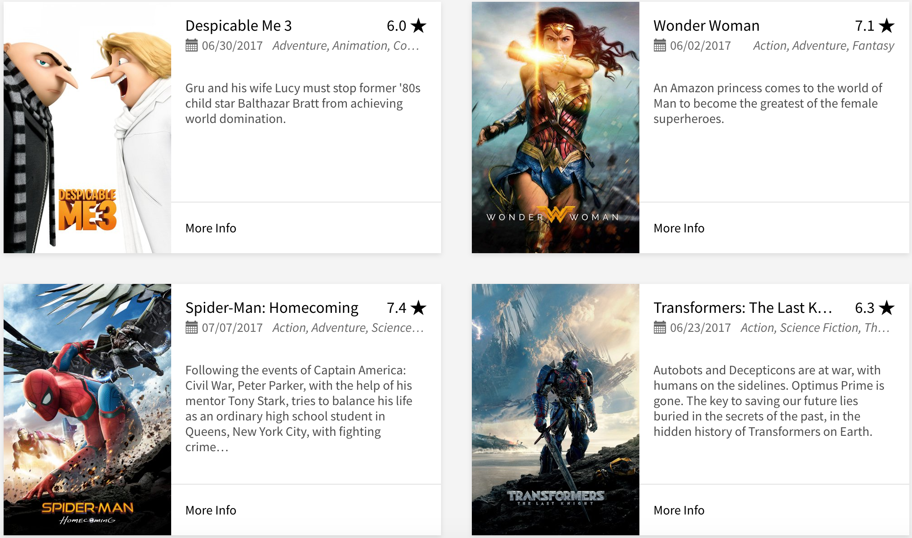

# P6-Build-Tableau-Dashboard

A movie producer :clapper: wants to better understand film industry :movie_camera: trends before releasing its next movie. I will explore OMDB movie dataset and build Tableau dashboards to answer a set of questions and tell a story with data. My work will be a reflection of the theory and practice of data visualization, such as visual encodings, design principles, and effective communication.

 
Source:- [TheMovieDB](https://www.themoviedb.org/movie/now-playing?language=en)

## Installation
1. For viewing the entire report along with data cleaning section (.ipynb file), you will need [jupyter notebook](http://jupyter.readthedocs.io/en/latest/install.html) with Python 3 installed.
2. For viewing Tableau workbooks, you will need to have either Tableau Public or Tableau Desktop installed. You will need a software license to use Tableau Desktop. If you don't have one, you can download Tableau Public [HERE](https://public.tableau.com/s/).

## Getting Started
1. Clone the Udacity-Data-Analyst repo to your computer.
2. Get into the folder using `cd Udacity-Data-Analyst/P6-Build-Tableau-Dashboard`.
3. Use `jupyter notebook` to launch Notebook Dashboard.
4. Open P6-Build-Tableau-Dashboard-0.ipynb from the Notebook Dashboard to view the detailed step-by-step guide for data cleaning and prepping for Tableau visualization.
5. P6-Build-Tableau-Dashboard-1.ipynb - final write-up for submission to Udacity.
6. Start exploring the world of movies.
