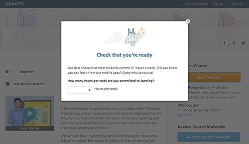

[A/B test Udacity's website]
==============================

## Project Overview
Udacity is considering online experiments to test potential improvements to their website. Two versions of the website are shown to different users - usually the existing website and a potential change. My goal is to design and analyze an A/B test and write up a recommendation on whether Udacity should introduce new version of the website. 

The project involves choosing and characterize metrics to evaluate experiments, designing an experiment with enough statistical power, analyzing the results and draw valid conclusions, and ensuring that the the participants of experiments are adequately protected.

Here is a screenshot of what the experiments look like:-

## Experiment Overview: Free Trial Screener
The [project instructions](https://docs.google.com/document/u/1/d/1aCquhIqsUApgsxQ8-SQBAigFDcfWVVohLEXcV6jWbdI/pub?embedded=True) contain more details.